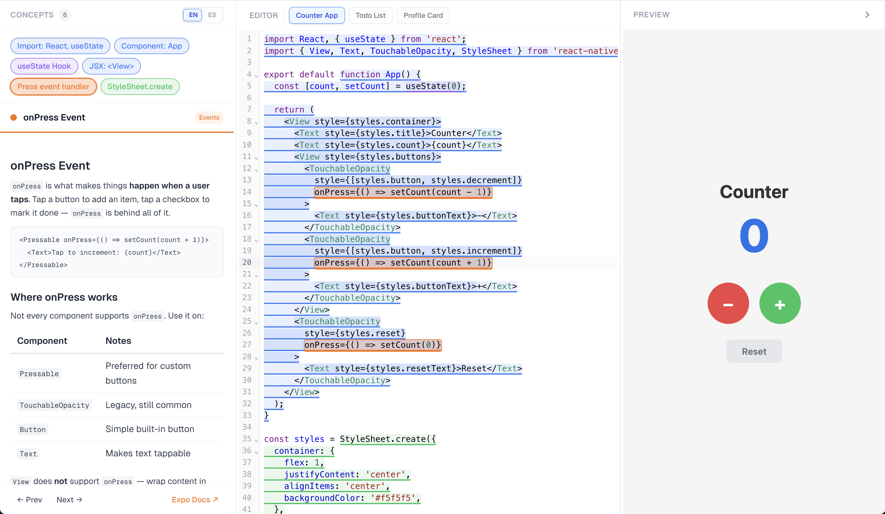

# Annotated Expo Playground

An educational tool that helps beginners understand LLM-generated Expo and React Native code. Paste code into the editor, and the playground automatically detects programming concepts, highlights them in the source, and walks you through each one with guided explanations and a live preview.



## How It Works

The playground has three columns:

1. **Concept Panel** (left) — Guided walkthroughs sourced from Expo docs. Click a highlighted concept in the editor or a concept chip to start learning.
2. **Code Editor** (center) — A CodeMirror 6 editor with color-coded, clickable highlights for every detected concept.
3. **Live Preview** (right) — A Snack SDK iframe that runs the code in real time.

Under the hood, the editor code is parsed with Babel, walked with a single merged AST traversal, and each detected concept (imports, hooks, components, JSX elements, styles, events) is mapped to a clickable decoration in the editor.

## Requirements

### macOS

- **Node.js** >= 24 (recommended: install via [nvm](https://github.com/nvm-sh/nvm) or [Homebrew](https://brew.sh))
- **npm** >= 10 (ships with Node.js 24)
- **Git**

### Windows

- **Node.js** >= 24 (recommended: install via [nvm-windows](https://github.com/coreybutler/nvm-windows) or the [official installer](https://nodejs.org))
- **npm** >= 10 (ships with Node.js 24)
- **Git** (recommended: [Git for Windows](https://gitforwindows.org))
- Enable long paths if you encounter `ENAMETOOLONG` errors:
  ```powershell
  git config --global core.longpaths true
  ```

## Getting Started

```bash
npm install
npm run dev
```

Open [http://localhost:3000](http://localhost:3000) in your browser. Pick an example app or paste your own Expo code.

## Scripts

| Command | Description |
|---------|-------------|
| `npm run dev` | Start dev server (Turbopack) |
| `npm run build` | Production build |
| `npm run lint` | ESLint |
| `npm run format` | Prettier (write) |
| `npm run format:check` | Prettier (check) |
| `npm run check-types` | TypeScript type checking |

## Tech Stack

| Layer | Tech |
|-------|------|
| Framework | Next.js 16 (App Router) |
| Language | TypeScript (strict) |
| Styling | Tailwind CSS v4 |
| Editor | CodeMirror 6 via `@uiw/react-codemirror` |
| AST Analysis | `@babel/parser` + `@babel/traverse` |
| Live Preview | `snack-sdk` |
| Content | `next-mdx-remote` (MDX concept cards) |

## Project Structure

```
app/
  layout.tsx              Root layout
  page.tsx                Main page (server component, loads MDX)
components/
  PlaygroundShell.tsx     Three-column layout orchestrator
  CodeEditor.tsx          CodeMirror editor with concept highlights
  ConceptPanel.tsx        Walkthrough panel with navigation
  ConceptList.tsx         Clickable concept chips
  SnackPreview.tsx        Snack SDK iframe wrapper
  ExamplePicker.tsx       Pre-loaded example selector
lib/
  analyzer.ts             Babel parse + single merged AST traversal
  categories.ts           Centralized category config (colors, labels)
  codemirror-decorations.ts  Concepts to CodeMirror decorations
  types.ts                Shared TypeScript types
  concept-loader.ts       MDX concept card loader
  detectors/              Concept detector visitor factories
    imports.ts            Import statements
    hooks.ts              useState, useEffect
    components.ts         Function components
    jsx-elements.ts       JSX elements (<View>, <Text>, etc.)
    styles.ts             StyleSheet.create, inline styles
    events.ts             onPress, onChangeText, etc.
    utils.ts              Shared detector helpers
    index.ts              Aggregates all visitor factories
content/
  concepts/               17 MDX educational cards
  examples/               Pre-loaded example apps (counter, todo, profile)
```

## Adding a New Concept

1. **Detector** — Create a visitor factory in `lib/detectors/` that pushes `DetectedConcept` objects into the shared concepts array. Export it and add it to `lib/detectors/index.ts`.
2. **MDX Card** — Add a `.mdx` file in `content/concepts/` with frontmatter matching the detector's `conceptId`.
3. **Category** — If adding a new category, update `lib/categories.ts` and add the corresponding `--color-concept-*` CSS variable in `app/globals.css` under `@theme`.

## License

[MIT](LICENSE)
